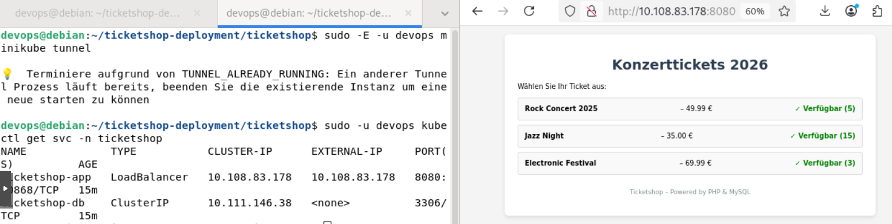

# Dieses Projekt ist ein minimaler, aber funktionstüchtiger Ticketshop, der als Gerüst für das Projekt unseres DevOps-Moduls genutzt werden kann.

Der Shop umfasst: 
Eine Liste der Konzert-Tickets
Dynamische Daten aus der MySQL-Datenbank
Persistente Speicherung (auch nach Neustart)



# DB Daten 
 
DB_HOST: localhost -- Achtung: im Zuge Ihres Deployments anpassen (/ticketshop/webshop/db.php)

DB_USER: 'ticketuser'

DB_PASS: 'ticketpass'

DB_NAME: 'tickets'

# -- Platzhalter für eigene Dokumentation --

# Architektur 

ggf. passt hier ein Schaubild Ihrer Container-Architektur hin 
--> z. B. mit https://app.diagrams.net/

# Ticketshop – Deployment Anleitung

Diese Anleitung beschreibt Schritt für Schritt, wie der Ticketshop auf einer lokalen VM
mit Minikube (Kubernetes) bereitgestellt wird.

---

## Voraussetzungen


- Folgende Tools müssen installiert sein:
  - `docker`
  - `minikube`
  - `kubectl`
- Der Deployment-User (z.B. `devops`) muss Mitglied der **docker-Gruppe** sein

---

## Projektstruktur

```
ticketshop/
├── Dockerfile
├── docker-compose.yml       ← Nur für lokalen Test ohne K8s (nicht bereitgestellt)
├── stop.sh                  ← Zum sauberen Herunterfahren (nicht bereitgestellt)
├── webpage/                 ← PHP-Anwendung (im Repository zu finden!)
│   ├── index.php
│   └── db.php
├── css/
│   └── style.css
├── data/
│   └── init.sql             ← Datenbankschema und Testdaten (im Repo zu finden!)
├── ansible/                 ← Ansible-Deployment (nicht im Repo bereitgestellt)
└── k8s/                     ← Kubernetes-Manifeste (nicht im Repo bereitgestellt)
    ├── 00-namespace.yml
    ├── 01-secret.yml
    ├── 02-configmap.yml
    ├── 03-pvc.yml
    ├── 04-db-deployment.yml
    └── 05-app-deployment.yml
```

---

## Schritt 1 – Projekt entpacken

```bash
unzip ticketshop-deployment.zip
cd ticketshop
```

---

## Schritt 2 – Minikube starten

Minikube darf **nicht als root** gestartet werden. Als normaler User ausführen:

```bash
minikube start --driver=docker --cpus=2 --memory=2048
```

Läuft Minikube bereits, kann dieser Schritt übersprungen werden. Status prüfen mit:

```bash
minikube status
```

---

## Schritt 3 – Docker-Image bauen

Das Image muss direkt in Minikubes internem Docker-Daemon gebaut werden,
damit Kubernetes es findet (kein externer Registry-Pull nötig).

```bash
# Minikube-Docker-Umgebung aktivieren
eval $(minikube docker-env)

# Image bauen
docker build -t ticketshop-app:latest .

# Umgebung zurücksetzen
eval $(minikube docker-env --unset)
```

---

## Schritt 4 – Kubernetes-Ressourcen anlegen (Ressourcen nicht im Repository bereitgestellt)

```bash
kubectl apply -f k8s/
```

Erwartete Ausgabe:

```
namespace/ticketshop created
secret/ticketshop-db-secret created
configmap/ticketshop-db-init created
persistentvolumeclaim/ticketshop-db-pvc created
deployment.apps/ticketshop-db created
service/ticketshop-db created
deployment.apps/ticketshop-app created
service/ticketshop-app created
```

---

## Schritt 5 – Auf Pods warten

```bash
# Datenbank abwarten (bis zu 120 Sekunden)
kubectl wait --for=condition=ready pod \
  -l app=ticketshop,tier=database -n ticketshop --timeout=120s

# App abwarten (bis zu 60 Sekunden)
kubectl wait --for=condition=ready pod \
  -l app=ticketshop,tier=frontend -n ticketshop --timeout=60s
```

Alle laufenden Pods anzeigen:

```bash
kubectl get pods -n ticketshop
```

---

## Schritt 6 – minikube tunnel starten

Der `ticketshop-app` Service ist vom Typ `LoadBalancer`. Damit er eine
externe IP bekommt und über `localhost:8080` erreichbar ist, muss
`minikube tunnel` laufen.

> **Wichtig:** Der Tunnel braucht root-Rechte für die Netzwerk-Routen,
> gleichzeitig aber den Minikube-Kontext des normalen Users.
> Deshalb das Flag `-E` (Umgebungsvariablen beibehalten) verwenden:

```bash
# Eventuell noch laufenden alten Tunnel beenden
sudo pkill -f "minikube tunnel" 2>/dev/null; sleep 2

# Tunnel starten (läuft im Vordergrund – Terminal offen lassen!)
sudo -E -u devops minikube tunnel
```

Der Tunnel muss **während des Betriebs offen bleiben**. Am besten in einem
eigenen Terminal-Fenster oder per `tmux`/`screen` laufen lassen.

---

## Schritt 7 – Erreichbarkeit prüfen

In einem zweiten Terminal:

```bash
kubectl get svc -n ticketshop
```

Sobald bei `ticketshop-app` unter `EXTERNAL-IP` der Wert `127.0.0.1` erscheint,
ist die Anwendung erreichbar:

```
NAME             TYPE           CLUSTER-IP      EXTERNAL-IP   PORT(S)
ticketshop-app   LoadBalancer   10.108.83.178   127.0.0.1     8080:...
```

→ **http://127.0.0.1:8080** im Browser öffnen.

---


## Nützliche Befehle

```bash
# Alle Ressourcen im Namespace anzeigen
kubectl get all -n ticketshop

# Logs der App-Pods
kubectl logs -l tier=frontend -n ticketshop

# Logs der Datenbank
kubectl logs -l tier=database -n ticketshop

# Live-Logs verfolgen
kubectl logs -f -l tier=frontend -n ticketshop

# In einen App-Pod einloggen
kubectl exec -it deploy/ticketshop-app -n ticketshop -- bash
```

---

## Häufige Fehler

**`Der Treiber "docker" sollte nicht mit Root Privilegien gestartet werden`**
Minikube nicht als root starten. Als normaler User (`devops`) ausführen.

**`EXTERNAL-IP` bleibt auf `<pending>`**
Der Tunnel läuft nicht oder hat keine root-Rechte für die Netzwerk-Routen.
Lösung: `sudo pkill -f "minikube tunnel"` und dann `sudo -E -u devops minikube tunnel`.

**`TUNNEL_ALREADY_RUNNING`**
Ein alter Tunnel-Prozess ist noch aktiv.
Lösung: `sudo pkill -f "minikube tunnel"`, kurz warten, dann neu starten.

**`couldn't get current server API group list: connection refused`**
Minikube läuft nicht. Lösung: `minikube start --driver=docker`

**Image wird nicht gefunden (`ErrImagePull` / `ImagePullBackOff`)**
Das Image wurde nicht im Minikube-Daemon gebaut. Schritte 3 wiederholen –
darauf achten, dass `eval $(minikube docker-env)` vor `docker build` ausgeführt wird.


